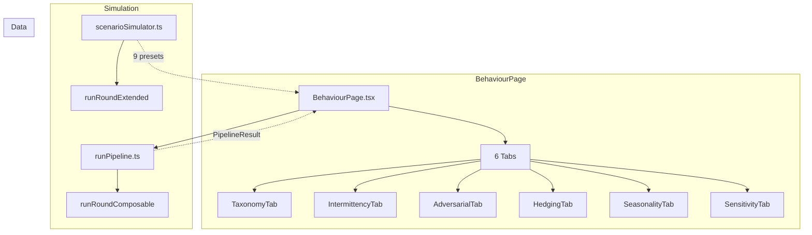
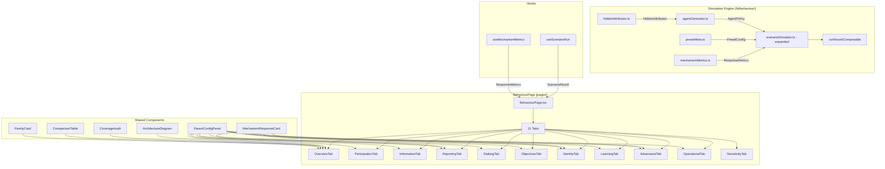
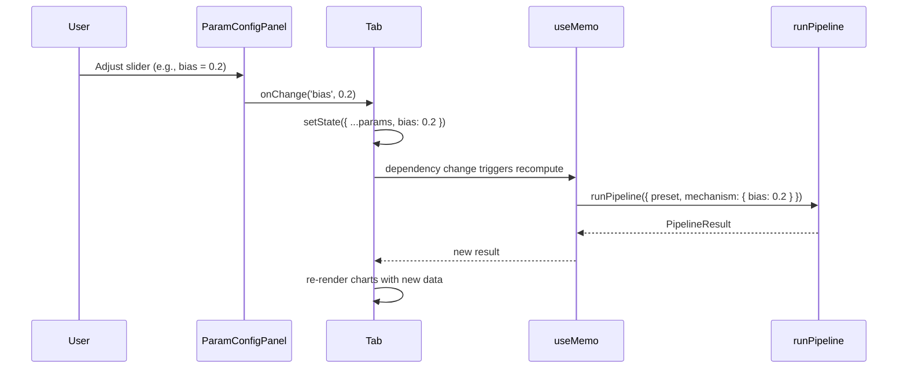

# Design Document: Behaviour Analysis Redesign

## Overview

This design covers the comprehensive redesign of the Behaviour Analysis section (`/behaviour` route) of the thesis dashboard. The current `BehaviourPage.tsx` (795 lines) has 6 tabs (Taxonomy, Intermittency, Adversarial, Hedging, Seasonality, Sensitivity) and 9 behaviour presets. The thesis taxonomy describes a richer structure: 9 behaviour families across a two-block architecture (Block A: core mechanism as pure state machine; Block B: user behaviour as agent policies).

The redesign:
1. Restructures the page around the full 9-family taxonomy with 11 tabs (Overview + 9 families + Sensitivity)
2. Introduces a user-level generative model with hidden attributes (intrinsic skill, CRRA γ, participation baseline, bias, budget, identity count)
3. Expands the simulation engine from 9 to 19 behaviour presets
4. Adds coverage audit UI, two-block architecture diagram, interactive parameter configuration, and mechanism response metrics
5. Closes the coverage gaps identified in `BEHAVIOUR_COVERAGE.md`

The thesis research question drives every design decision:
> Can combining stake with an online, time-varying skill layer improve aggregate forecasts under non-stationarity, strategic behaviour, and intermittent participation?

### Integration with Existing Specs

The `dashboard-ui-redesign` spec covers broader UI improvements (sidebar, charts, narrative flow, formula registry). This spec focuses exclusively on the behaviour analysis domain. Shared components from the UI redesign (ChartCard, ZoomBadge, useChartZoom, FourPanelLayout, DeltaBarChart) are consumed here but not redefined.

## Architecture

### Current Architecture



The current page runs all 9 presets via `runPipeline()` in `useMemo` hooks at the top of `BehaviourPage`, producing `PipelineResult` objects. Each tab receives the relevant results as props. The `scenarioSimulator.ts` provides an alternative simulation path via `simulateScenario()` using `runRoundExtended`, but the page currently uses `runPipeline` exclusively.

### Redesigned Architecture



### Key Architectural Decisions

1. **Simulation via `runPipeline`, not `simulateScenario`**: The page continues using `runPipeline()` from `runPipeline.ts` as the primary simulation path. New presets are added to `buildRoundBehaviour()` in `runPipeline.ts` and to the `BehaviourPresetId` union type. The `scenarioSimulator.ts` `simulateScenario()` function is kept in sync but is secondary. Rationale: `runPipeline` uses the full composable round with CRPS scoring, quantile forecasts, and all builder selections — `simulateScenario` uses the simpler `runRoundExtended`.

2. **Hidden attributes as preset configuration, not runtime state**: Hidden attributes (intrinsic skill, CRRA γ, bias, etc.) are defined per-preset in a static configuration object. They are sampled once when the preset is selected and do not change across rounds. This keeps the simulation deterministic and avoids adding mutable state to the agent model.

3. **Lazy simulation with `useMemo` + dependency on controls**: Each tab runs its simulations in `useMemo` hooks keyed on the preset's parameter values. When the user adjusts a parameter in the config panel, the `useMemo` dependency changes and the simulation re-runs. No Web Workers — the 300-round simulations complete in <100ms on modern hardware.

4. **Tab components as separate functions**: Each of the 11 tabs is a separate function component (same pattern as current `TaxonomyTab`, `IntermittencyTab`, etc.) receiving simulation results as props. This keeps the main `BehaviourPage` component manageable.

5. **Shared comparison infrastructure**: The cross-behaviour comparison table and grouped bar chart are extracted into reusable components (`ComparisonTable`, `FamilyImpactChart`) used in the Overview tab and available to individual family tabs.


## Components and Interfaces

### 1. Two-Block Architecture Diagram

#### ArchitectureDiagram (`components/behaviour/ArchitectureDiagram.tsx`)

A visual component showing the Block A / Block B separation with the Behaviour Contract interface.

```typescript
interface ArchitectureDiagramProps {
  /** Which block to highlight on hover (controlled externally or internally) */
  highlightedBlock?: 'A' | 'B' | null;
  onBlockHover?: (block: 'A' | 'B' | null) => void;
}
```

Layout: Two rounded boxes side by side connected by arrows. Block B (left, violet accent) shows "Agent Policies: π(attributes, state, t) → action". Block A (right, teal accent) shows "Core Mechanism: state machine". Arrows between them:
- B → A: `(participate, report, deposit)` labelled "Behaviour Contract"
- A → B: `(wealth, σ, r̂, round)` labelled "Platform State"

Implementation: Pure SVG/HTML with Tailwind styling. Hover on a block highlights it and shows a tooltip. Uses Framer Motion for subtle entrance animation (fade + scale, 200ms).

### 2. Coverage Audit Components

#### CoverageAudit (`components/behaviour/CoverageAudit.tsx`)

Displays the full taxonomy coverage status.

```typescript
interface CoverageItem {
  name: string;
  status: 'experiment' | 'taxonomy-only' | 'not-covered';
  experimentTab?: string; // tab to navigate to if experiment-backed
}

interface CoverageFamily {
  family: string;
  items: CoverageItem[];
}

interface CoverageAuditProps {
  families: CoverageFamily[];
  onNavigate?: (tab: string) => void;
}
```

Renders:
- Aggregate stats bar: total items, experiment-backed count, taxonomy-only count, not-covered count, overall coverage %
- Per-family sections with a coverage bar (green/amber/grey segments)
- Each item is a row with a status badge (green dot = experiment, amber dot = taxonomy-only, grey dot = not covered)
- Experiment-backed items are clickable → navigate to the corresponding tab

#### FamilyCard (`components/behaviour/FamilyCard.tsx`)

```typescript
interface FamilyCardProps {
  family: string;
  description: string;
  items: Array<{ name: string; status: 'experiment' | 'taxonomy-only' | 'not-covered' }>;
  color: string; // Tailwind colour class e.g. 'bg-sky-100 text-sky-700 border-sky-200'
  onClick?: () => void;
}
```

Renders a card with family name, description, sub-items as pills with coverage status indicators. Used in the Overview tab's taxonomy grid.

### 3. Comparison Components

#### ComparisonTable (`components/behaviour/ComparisonTable.tsx`)

```typescript
interface ComparisonRow {
  name: string;
  family: string;
  meanCrps: number;
  deltaCrpsPct: number;
  gini: number;
  nEff: number;
  participation: number;
  color: string;
}

interface ComparisonTableProps {
  rows: ComparisonRow[];
  baselineName?: string;
  defaultSortKey?: keyof ComparisonRow;
  onRowClick?: (name: string) => void;
}
```

Features:
- Sortable columns (click header to sort)
- Default sort by `deltaCrpsPct` descending (most damaging first)
- Colour-coded Δ CRPS: green (< −1%), grey (−1% to +1%), red (> +1%)
- Row click navigates to the corresponding experiment tab

#### FamilyImpactChart (`components/behaviour/FamilyImpactChart.tsx`)

```typescript
interface FamilyImpactChartProps {
  data: Array<{
    family: string;
    worstDeltaCrpsPct: number;
    color: string;
  }>;
}
```

Grouped bar chart showing worst-case Δ CRPS per family. Uses Recharts BarChart.

### 4. Parameter Configuration Panel

#### ParamConfigPanel (`components/behaviour/ParamConfigPanel.tsx`)

```typescript
interface ParamConfig {
  key: string;
  label: string;
  min: number;
  max: number;
  step: number;
  default: number;
  unit?: string;
}

interface ParamConfigPanelProps {
  presetId: BehaviourPresetId;
  params: ParamConfig[];
  values: Record<string, number>;
  onChange: (key: string, value: number) => void;
  onReset: () => void;
  isRunning?: boolean;
}
```

Renders:
- Slider + numeric input for each parameter
- Min/max labels on slider
- "Reset to default" button
- Loading spinner overlay when `isRunning` is true
- Compact layout: 2-column grid on desktop, stacked on mobile

### 5. Mechanism Response Metrics

#### MechanismResponseCard (`components/behaviour/MechanismResponseCard.tsx`)

```typescript
interface MechanismResponseMetrics {
  skillRecoveryRounds: number | null; // rounds for σ to drop below 0.5 after attack
  wealthPenalty: number; // attacker final wealth - honest baseline wealth
  aggregateContamination: number; // peak Δ CRPS during attack
  concentrationImpact: number; // Δ Gini vs baseline
  ewmaHalfLife: number; // ln(2)/ρ
}

interface MechanismResponseCardProps {
  metrics: MechanismResponseMetrics;
  attackVector: string;
  defenceMechanism: string;
  effectiveness: number; // % of attack impact absorbed
}
```

Renders a card with four metric values, a description of the attack vector, the defence mechanism, and a quantified effectiveness measure.

#### PhaseTransitionMarker

For presets with phase transitions (e.g., reputation_reset), the time-series charts display a vertical `ReferenceLine` at the transition round with a label. This is handled inline in the chart rendering, not as a separate component.

### 6. Generative Model Display

#### GenerativeModelCard (`components/behaviour/GenerativeModelCard.tsx`)

```typescript
interface HiddenAttributeDisplay {
  name: string;
  symbol: string;
  distribution: string; // e.g. "Beta(2, 5)" or "fixed: 0.88"
  value: number; // current preset value
  description: string;
}

interface GenerativeModelCardProps {
  presetId: BehaviourPresetId;
  attributes: HiddenAttributeDisplay[];
}
```

Displays the generative model structure: "Sample hidden attributes → Generate per-round actions". Shows a table of hidden attributes with their distributions and current values for the selected preset. Includes the CRRA utility formula with explanation.

### 7. Tab Components

Each tab follows the same pattern:

```typescript
interface FamilyTabProps {
  baseline: PipelineResult;
  experiments: Record<string, PipelineResult>;
  onParamChange?: (presetId: string, params: Record<string, number>) => void;
}
```

The 11 tabs:
- **OverviewTab**: Taxonomy grid (9 FamilyCards), ArchitectureDiagram, CoverageAudit, ComparisonTable, FamilyImpactChart
- **ParticipationTab**: Bursty experiment (existing), selective entry (new)
- **InformationTab**: Bias, miscalibration, correlated errors, costly information experiments
- **ReportingTab**: Noisy reporting, reputation gaming, sandbagging experiments
- **StakingTab**: Budget constraints, house-money, lumpy bets, Kelly-like sizing, deposit policy comparison (existing)
- **ObjectivesTab**: CRRA comparison, loss aversion, non-monetary motives
- **IdentityTab**: Sybil (existing), collusion (existing), reputation reset (existing)
- **LearningTab**: Reinforcement from profits, rule learning, exploration vs exploitation
- **AdversarialTab**: Manipulator (existing), arbitrageur (existing), evader (existing) — with mechanism response metrics
- **OperationalTab**: Latency, interface errors, automation patterns
- **SensitivityTab**: λ × σ_min sweep (existing), extended with new presets

### 8. Custom Hooks

#### useScenarioRun (`hooks/useScenarioRun.ts`)

```typescript
interface UseScenarioRunOptions {
  presetId: BehaviourPresetId;
  rounds?: number;
  seed?: number;
  n?: number;
  mechanismOverrides?: Record<string, number>;
}

function useScenarioRun(options: UseScenarioRunOptions): {
  result: PipelineResult;
  isStale: boolean; // true while recomputing after param change
}
```

Wraps `runPipeline()` in a `useMemo` with the options as dependencies. Returns the result and a staleness flag (always false in synchronous mode, but the interface supports future async).

#### useMechanismMetrics (`hooks/useMechanismMetrics.ts`)

```typescript
function useMechanismMetrics(
  test: PipelineResult,
  baseline: PipelineResult,
  attackerIndex: number,
  transitionRound?: number,
): MechanismResponseMetrics
```

Computes mechanism response metrics by comparing test and baseline pipeline results. Derives skill recovery time, wealth penalty, aggregate contamination, and concentration impact.


## Data Models

### Expanded BehaviourPresetId

The `BehaviourPresetId` union type in `scenarioSimulator.ts` expands from 9 to 19 presets:

```typescript
export type BehaviourPresetId =
  // Existing (9)
  | 'baseline'
  | 'bursty'
  | 'risk_averse'
  | 'manipulator'
  | 'sybil'
  | 'evader'
  | 'arbitrageur'
  | 'collusion'
  | 'reputation_reset'
  // New (10)
  | 'biased'           // Information: systematic bias in reports
  | 'miscalibrated'    // Information: overconfident/underconfident
  | 'noisy_reporter'   // Reporting: random noise added to truthful reports
  | 'budget_constrained' // Staking: finite wealth that can run out
  | 'house_money'      // Staking: increased risk-taking after gains
  | 'kelly_sizer'      // Staking: deposit proportional to estimated edge
  | 'reputation_gamer' // Reporting: sacrifice accuracy to inflate σ
  | 'sandbagger'       // Reporting: deliberately underperform
  | 'reinforcement_learner' // Learning: increase participation after profits
  | 'latency_exploiter'; // Operational: reports with partial outcome info
```

### Hidden Attributes Model

```typescript
/** Stable per-agent parameters sampled once at creation. */
export interface HiddenAttributes {
  /** Intrinsic signal precision — lower noise = better forecaster */
  intrinsicSkill: number;
  /** CRRA risk aversion parameter: 0 = risk-neutral, >0 = risk-averse, <0 = risk-seeking */
  crraGamma: number;
  /** Base probability of participating in any given round */
  participationBaseline: number;
  /** Systematic bias added to reports (positive = overestimate) */
  bias: number;
  /** Initial wealth / budget */
  initialBudget: number;
  /** Number of identities (1 = honest, >1 = sybil) */
  identityCount: number;
}
```

### Preset Configuration

```typescript
/** Full configuration for a behaviour preset, including hidden attributes and policy parameters. */
export interface PresetConfig {
  id: BehaviourPresetId;
  label: string;
  description: string;
  family: BehaviourFamily;
  levers: string[];
  /** Hidden attributes for each agent role in this preset */
  agentProfiles: Array<{
    role: string;
    count: number;
    attributes: HiddenAttributes;
  }>;
  /** Adjustable parameters exposed in the config panel */
  tunableParams: ParamConfig[];
}

export type BehaviourFamily =
  | 'participation'
  | 'information'
  | 'reporting'
  | 'staking'
  | 'objectives'
  | 'identity'
  | 'learning'
  | 'adversarial'
  | 'operational';
```

### Coverage Data Model

```typescript
export interface TaxonomyItem {
  name: string;
  family: BehaviourFamily;
  status: 'experiment' | 'taxonomy-only' | 'not-covered';
  presetId?: BehaviourPresetId; // if experiment-backed
  tab?: string; // tab to navigate to
}

export const TAXONOMY_ITEMS: TaxonomyItem[] = [
  // Participation (7 items)
  { name: 'Availability', family: 'participation', status: 'taxonomy-only' },
  { name: 'Burstiness', family: 'participation', status: 'experiment', presetId: 'bursty', tab: 'Participation' },
  { name: 'Deadline effects', family: 'participation', status: 'not-covered' },
  { name: 'Selection on edge', family: 'participation', status: 'taxonomy-only' },
  { name: 'Selection on confidence', family: 'participation', status: 'not-covered' },
  { name: 'Avoiding skill decay', family: 'participation', status: 'taxonomy-only' },
  { name: 'Task choice', family: 'participation', status: 'not-covered' },
  // Information (6 items)
  { name: 'Signal precision', family: 'information', status: 'taxonomy-only' },
  { name: 'Systematic bias', family: 'information', status: 'experiment', presetId: 'biased', tab: 'Information' },
  { name: 'Miscalibration', family: 'information', status: 'experiment', presetId: 'miscalibrated', tab: 'Information' },
  { name: 'Correlated errors', family: 'information', status: 'taxonomy-only' },
  { name: 'Drift adaptation', family: 'information', status: 'experiment', tab: 'Information' },
  { name: 'Costly information', family: 'information', status: 'not-covered' },
  // Reporting (6 items)
  { name: 'Truthful reporting', family: 'reporting', status: 'experiment', presetId: 'baseline', tab: 'Reporting' },
  { name: 'Noisy reporting', family: 'reporting', status: 'experiment', presetId: 'noisy_reporter', tab: 'Reporting' },
  { name: 'Hedged reports', family: 'reporting', status: 'experiment', presetId: 'risk_averse', tab: 'Reporting' },
  { name: 'Strategic misreporting', family: 'reporting', status: 'experiment', presetId: 'manipulator', tab: 'Adversarial' },
  { name: 'Reputation gaming', family: 'reporting', status: 'experiment', presetId: 'reputation_gamer', tab: 'Reporting' },
  { name: 'Sandbagging', family: 'reporting', status: 'experiment', presetId: 'sandbagger', tab: 'Reporting' },
  // Staking (4 items)
  { name: 'Budget constraints', family: 'staking', status: 'experiment', presetId: 'budget_constrained', tab: 'Staking' },
  { name: 'Deposit policies', family: 'staking', status: 'experiment', tab: 'Staking' },
  { name: 'House-money effect', family: 'staking', status: 'experiment', presetId: 'house_money', tab: 'Staking' },
  { name: 'Kelly-like sizing', family: 'staking', status: 'experiment', presetId: 'kelly_sizer', tab: 'Staking' },
  // Objectives (5 items)
  { name: 'Expected value vs CRRA', family: 'objectives', status: 'experiment', tab: 'Objectives' },
  { name: 'Risk aversion', family: 'objectives', status: 'experiment', presetId: 'risk_averse', tab: 'Objectives' },
  { name: 'Loss aversion', family: 'objectives', status: 'taxonomy-only' },
  { name: 'Signalling', family: 'objectives', status: 'taxonomy-only' },
  { name: 'Leaderboard motives', family: 'objectives', status: 'taxonomy-only' },
  // Identity (5 items)
  { name: 'Single identity', family: 'identity', status: 'experiment', presetId: 'baseline', tab: 'Identity' },
  { name: 'Sybil split', family: 'identity', status: 'experiment', presetId: 'sybil', tab: 'Identity' },
  { name: 'Collusion', family: 'identity', status: 'experiment', presetId: 'collusion', tab: 'Identity' },
  { name: 'Reputation reset', family: 'identity', status: 'experiment', presetId: 'reputation_reset', tab: 'Identity' },
  { name: 'Dormancy/reactivation', family: 'identity', status: 'taxonomy-only' },
  // Learning (3 items)
  { name: 'Reinforcement from profits', family: 'learning', status: 'experiment', presetId: 'reinforcement_learner', tab: 'Learning' },
  { name: 'Rule learning', family: 'learning', status: 'taxonomy-only' },
  { name: 'Exploration vs exploitation', family: 'learning', status: 'not-covered' },
  // Adversarial (6 items)
  { name: 'Manipulation', family: 'adversarial', status: 'experiment', presetId: 'manipulator', tab: 'Adversarial' },
  { name: 'Arbitrage', family: 'adversarial', status: 'experiment', presetId: 'arbitrageur', tab: 'Adversarial' },
  { name: 'Evasion', family: 'adversarial', status: 'experiment', presetId: 'evader', tab: 'Adversarial' },
  { name: 'Sybil attack', family: 'adversarial', status: 'experiment', presetId: 'sybil', tab: 'Identity' },
  { name: 'Collusion attack', family: 'adversarial', status: 'experiment', presetId: 'collusion', tab: 'Identity' },
  { name: 'Volume gaming', family: 'adversarial', status: 'taxonomy-only' },
  // Operational (4 items)
  { name: 'Latency', family: 'operational', status: 'experiment', presetId: 'latency_exploiter', tab: 'Operational' },
  { name: 'Missed rounds', family: 'operational', status: 'experiment', presetId: 'bursty', tab: 'Participation' },
  { name: 'Interface errors', family: 'operational', status: 'taxonomy-only' },
  { name: 'Automation patterns', family: 'operational', status: 'taxonomy-only' },
];
```

### Mechanism Response Metrics

```typescript
export interface MechanismResponseMetrics {
  /** Rounds for attacker's σ to drop below 0.5 after attack onset. null if never drops. */
  skillRecoveryRounds: number | null;
  /** Attacker's final wealth minus honest baseline final wealth */
  wealthPenalty: number;
  /** Peak |Δ CRPS| during attack window vs baseline */
  aggregateContamination: number;
  /** Δ Gini vs baseline at end of simulation */
  concentrationImpact: number;
  /** EWMA half-life: ln(2)/ρ */
  ewmaHalfLife: number;
}
```

Computation: `useMechanismMetrics` iterates over the test pipeline's traces to find the first round where the attacker's σ drops below 0.5 after the transition point. Wealth penalty is `test.finalState[attackerIndex].wealth - baseline.finalState[attackerIndex].wealth`. Aggregate contamination is `max(|test.rounds[t].error - baseline.rounds[t].error|)` over the attack window. Concentration impact is `test.summary.finalGini - baseline.summary.finalGini`.

### New Behaviour Preset Implementations

Each new preset is implemented as a branch in `buildRoundBehaviour()` in `runPipeline.ts`. The pattern follows the existing presets:

| Preset | Family | Key Behaviour | Implementation |
|--------|--------|---------------|----------------|
| `biased` | Information | Adds systematic bias to reports | `report = clamp(baseReport + bias)` where `bias` is a preset parameter (default 0.15) |
| `miscalibrated` | Information | Overconfident: reports pushed away from 0.5 | `report = clamp(0.5 + (baseReport - 0.5) * overconfidenceFactor)` |
| `noisy_reporter` | Reporting | Random noise added to truthful reports | `report = clamp(baseReport + normalSample(rng) * noiseScale)` with higher `noiseScale` |
| `budget_constrained` | Staking | Finite wealth, can reach ruin | `riskFraction` unchanged but wealth depletes; agent stops when `wealth < minDeposit` |
| `house_money` | Staking | Increase risk after gains | `riskFraction *= (1 + houseFactor * max(0, recentProfit))` |
| `kelly_sizer` | Staking | Deposit proportional to estimated edge | `riskFraction = kellyFraction * sigma * (1 - sigma)` (edge estimate) |
| `reputation_gamer` | Reporting | Sacrifice accuracy to inflate σ | Reports near previous aggregate to minimise measured loss |
| `sandbagger` | Reporting | Deliberately underperform | `report = clamp(baseReport + normalSample(rng) * sandbaggingNoise)` with large noise |
| `reinforcement_learner` | Learning | Increase participation after profits | `pPart = basePart + reinforceFactor * clamp(recentProfit, -1, 1)` |
| `latency_exploiter` | Operational | Reports with partial outcome info | `report = clamp(latencyWeight * outcome + (1 - latencyWeight) * baseReport)` |

### CRRA Utility Function

For the Objectives tab, the CRRA utility function is used to model agent preferences:

```
u(w) = w^(1−γ) / (1−γ)   for γ ≠ 1
u(w) = ln(w)               for γ = 1
```

Where γ is the CRRA parameter from `HiddenAttributes.crraGamma`. This is displayed as a formula card and used to compute optimal deposit fractions for different risk aversion levels. The implementation computes expected utility over wealth outcomes rather than expected value, producing different deposit trajectories for different γ values.

### Data Flow for Interactive Parameter Configuration



The parameter configuration panel updates local state in the tab component. The `useMemo` hook detects the dependency change and re-runs the simulation. Since 300-round simulations complete in <100ms, no debouncing or loading state is needed for most parameter changes. The `isRunning` prop on `ParamConfigPanel` is a safety net for edge cases.


## Correctness Properties

*A property is a characteristic or behavior that should hold true across all valid executions of a system — essentially, a formal statement about what the system should do. Properties serve as the bridge between human-readable specifications and machine-verifiable correctness guarantees.*

### Property 1: FamilyCard displays all required fields

*For any* FamilyCard component with a family name, description, and list of sub-items with coverage statuses, the rendered output should contain the family name, a one-sentence description, all sub-item names, and a coverage indicator (experiment/taxonomy-only/not-covered) for each sub-item.

**Validates: Requirements 1.2**

### Property 2: Coverage statistics are mathematically correct

*For any* set of taxonomy items with statuses (experiment, taxonomy-only, not-covered), the coverage audit's aggregate statistics should satisfy: experiment_count + taxonomy_only_count + not_covered_count = total_items, and coverage_percentage = experiment_count / total_items * 100.

**Validates: Requirements 1.3, 13.2**

### Property 3: Experiment-backed item click navigates to correct tab

*For any* taxonomy item with status 'experiment' and a defined tab, clicking that item should trigger navigation to the tab specified in the item's `tab` field.

**Validates: Requirements 1.4, 13.3**

### Property 4: Preset selection shows correct hidden attributes

*For any* BehaviourPresetId, selecting that preset should display hidden attributes that match the preset's defined `agentProfiles` configuration — specifically the intrinsicSkill, crraGamma, participationBaseline, bias, initialBudget, and identityCount values.

**Validates: Requirements 3.2, 3.3**

### Property 5: Bias experiment error reflects bias magnitude

*For any* bias magnitude parameter in [0, 0.5], running the biased preset should produce a mean CRPS that is greater than or equal to the baseline mean CRPS. The aggregate error should increase monotonically with bias magnitude.

**Validates: Requirements 4.2**

### Property 6: Warning indicator for slow skill downweighting

*For any* simulation result where the mechanism fails to reduce a poor forecaster's σ below 0.5 within 50 rounds of attack onset, the corresponding metric display should include a warning indicator. Conversely, if σ drops below 0.5 within 50 rounds, no warning should appear.

**Validates: Requirements 4.5**

### Property 7: Noisy reporting CRPS degradation scales with noise

*For any* noise scale parameter, the noisy reporter preset's mean CRPS should be greater than or equal to the baseline CRPS, and the displayed noise level should match the configured noise scale parameter.

**Validates: Requirements 5.2**

### Property 8: Budget-constrained ruin detection

*For any* budget-constrained simulation, the reported ruin count should equal the number of agents whose final wealth is below the minimum deposit threshold, and the ruin round for each agent should be the first round where their wealth dropped below that threshold.

**Validates: Requirements 6.2**

### Property 9: Higher CRRA γ produces lower deposits

*For any* two CRRA γ values where γ₁ < γ₂ (both ≥ 0), the mean deposit fraction for agents with γ₂ should be less than or equal to the mean deposit fraction for agents with γ₁, reflecting that higher risk aversion reduces staking.

**Validates: Requirements 8.2**

### Property 10: Reinforcement learner profit-participation correlation

*For any* reinforcement learner simulation, the correlation between lagged profit (round t−1) and participation probability (round t) should be positive, reflecting that profitable rounds increase future participation.

**Validates: Requirements 7.2**

### Property 11: Latency exploiter information advantage

*For any* latency weight parameter > 0, the latency exploiter's mean score should be higher than the baseline agent's mean score (because the exploiter has partial outcome information), and the resulting Gini should be higher than baseline (unfair advantage concentrates wealth).

**Validates: Requirements 9.2**

### Property 12: Tab content indicator correctness

*For any* tab in the 11-tab navigation, the tab indicator should show "experiment-backed" if and only if at least one taxonomy item with status 'experiment' maps to that tab. Tabs with no experiment-backed items should show "taxonomy only".

**Validates: Requirements 10.3, 10.4**

### Property 13: ComparisonTable contains all required columns

*For any* set of ComparisonRow data, the rendered ComparisonTable should contain columns for: behaviour name, family, mean CRPS, Δ CRPS vs baseline (%), Gini, N_eff, and mean participation rate. No column may be missing.

**Validates: Requirements 11.1**

### Property 14: ComparisonTable sort correctness

*For any* set of ComparisonRow data and *for any* sortable column, clicking that column header should produce rows sorted by that column's values. The default sort (before any click) should be by Δ CRPS descending (most damaging first).

**Validates: Requirements 11.2, 11.3**

### Property 15: ComparisonTable Δ CRPS colour coding

*For any* Δ CRPS value, the colour applied to the cell should be: green if Δ < −1%, grey if −1% ≤ Δ ≤ +1%, red if Δ > +1%. The colour should be a deterministic function of the value.

**Validates: Requirements 11.5**

### Property 16: Config panel shows correct parameters with ranges

*For any* BehaviourPresetId, the ParamConfigPanel should display exactly the tunable parameters defined in that preset's `PresetConfig.tunableParams`, each with the correct min, max, step, and default values.

**Validates: Requirements 12.1, 12.3**

### Property 17: Parameter change produces different simulation results

*For any* preset and *for any* tunable parameter, changing that parameter's value from its default should produce a PipelineResult with a different `summary.meanError` than the default configuration (assuming the parameter has a non-trivial effect on the simulation).

**Validates: Requirements 12.2**

### Property 18: Coverage audit groups items correctly by family

*For any* set of taxonomy items, the coverage audit should group items by their `family` field, and each family group's coverage bar should show segments proportional to the count of experiment/taxonomy-only/not-covered items in that family.

**Validates: Requirements 13.1, 13.4**

### Property 19: All presets produce valid ScenarioResult

*For any* BehaviourPresetId (all 19), running `runPipeline` with that preset should produce a PipelineResult with: a non-empty `rounds` array, a `finalState` array with length equal to the number of agents, and a `summary` object with finite numeric values for all fields.

**Validates: Requirements 14.1, 14.3**

### Property 20: Biased preset produces biased reports

*For any* simulation using the 'biased' preset with bias parameter > 0, the mean report across all rounds should be shifted in the direction of the bias compared to the baseline preset's mean report. This validates that the Agent_Policy correctly applies the hidden bias attribute.

**Validates: Requirements 14.2**

### Property 21: Simulation determinism

*For any* BehaviourPresetId and *for any* seed value, running the simulation twice with the same preset, seed, rounds, and agent count should produce identical `rounds` arrays (same error, participation, nEff values at every round).

**Validates: Requirements 14.4**

### Property 22: Mechanism response metrics completeness

*For any* adversarial BehaviourPresetId (manipulator, evader, sybil, collusion, reputation_reset, arbitrageur), the MechanismResponseMetrics should contain: a finite skillRecoveryRounds (or null), a finite wealthPenalty, a finite aggregateContamination ≥ 0, a finite concentrationImpact, and ewmaHalfLife = ln(2)/ρ.

**Validates: Requirements 15.1, 15.3**

### Property 23: EWMA half-life correctness

*For any* ρ value in (0, 1], the displayed EWMA half-life should equal ln(2)/ρ, rounded to one decimal place.

**Validates: Requirements 15.4**


## Error Handling

### Simulation Errors

1. **Invalid preset ID**: If an unknown `BehaviourPresetId` is passed to `runPipeline`, the `buildRoundBehaviour` function falls through to the default (baseline) behaviour. No crash, but the result won't match the expected preset. The UI should validate preset IDs against the `BehaviourPresetId` union type at compile time.

2. **Numerical instability**: The simulation uses `clamp()` extensively to keep values in [0, 1]. Division by zero is guarded with `EPS = 1e-12` checks (existing pattern in `runRoundComposable.ts`). Wealth can reach 0 but not go negative (`Math.max(0, ...)` on wealth updates).

3. **Agent ruin**: When an agent's wealth drops below the minimum deposit threshold, they effectively can't participate. The `budget_constrained` preset explicitly models this. The simulation continues — the agent just has zero deposit and zero influence. No special error state needed.

4. **Parameter out of range**: The `ParamConfigPanel` enforces min/max bounds on sliders. If a value somehow exceeds bounds (e.g., programmatic override), `clamp()` in the simulation catches it. The config panel should also validate on change and snap to bounds.

5. **Simulation timeout**: The 300-round simulations complete in <100ms. The 2-second timeout in Requirement 12.5 is a safety net. If exceeded (unlikely), the `isRunning` flag on `ParamConfigPanel` disables controls and shows a spinner. The simulation is synchronous, so there's no actual async timeout — this is purely a UX guard for future async scenarios.

### UI Errors

1. **Missing experiment data**: Tabs for taxonomy-only families (e.g., some items in Learning, Operational) display a "Taxonomy only — no simulation data" indicator instead of charts. No error state needed — this is expected.

2. **Chart rendering failures**: Recharts handles empty data gracefully (renders empty axes). If a simulation produces NaN values, the `fmt()` utility returns '—'. Charts with all-NaN data show empty plots with axis labels.

3. **Navigation to non-existent tab**: If a coverage audit item references a tab that doesn't exist, the click handler should no-op. The `TAXONOMY_ITEMS` data is static and validated at build time, so this shouldn't occur.

### Data Validation

The `HiddenAttributes` interface enforces types at compile time. Runtime validation is minimal:
- `intrinsicSkill` must be in [0, 1] — clamped in simulation
- `crraGamma` can be any real number — no clamping needed (CRRA is defined for all γ)
- `participationBaseline` must be in [0, 1] — clamped
- `bias` can be any real number — clamped in report generation
- `initialBudget` must be > 0 — enforced by preset config
- `identityCount` must be ≥ 1 — enforced by preset config

## Testing Strategy

### Dual Testing Approach

The testing strategy uses both unit tests and property-based tests:

- **Unit tests** (Vitest): Verify specific examples, edge cases, and UI rendering. Focus on:
  - Specific preset configurations produce expected outputs (e.g., baseline produces near-zero Δ CRPS)
  - Edge cases: zero agents, zero rounds, extreme parameter values
  - UI component rendering: FamilyCard shows correct content, ComparisonTable renders all columns
  - Integration: clicking a coverage item navigates to the correct tab

- **Property-based tests** (fast-check via Vitest): Verify universal properties across randomised inputs. Focus on:
  - Simulation determinism (Property 21)
  - Coverage statistics correctness (Property 2)
  - Sort correctness (Property 14)
  - Colour coding correctness (Property 15)
  - All presets produce valid output (Property 19)
  - EWMA half-life computation (Property 23)

### Property-Based Testing Configuration

- **Library**: `fast-check` (already available in the Node ecosystem, integrates with Vitest)
- **Minimum iterations**: 100 per property test
- **Tag format**: Each property test includes a comment: `// Feature: behaviour-analysis-redesign, Property {N}: {title}`

### Test Organisation

```
dashboard/src/__tests__/behaviour/
  scenarioSimulator.test.ts    — Properties 19, 20, 21 (simulation engine)
  mechanismMetrics.test.ts     — Properties 22, 23 (mechanism response metrics)
  coverageAudit.test.ts        — Properties 2, 3, 18 (coverage data)
  comparisonTable.test.ts      — Properties 13, 14, 15 (comparison table logic)
  paramConfig.test.ts          — Properties 16, 17 (parameter configuration)
  behaviourProperties.test.ts  — Properties 5, 6, 7, 8, 9, 10, 11 (behaviour-specific)
  familyCard.test.ts           — Property 1 (FamilyCard rendering)
  tabIndicator.test.ts         — Properties 4, 12 (tab navigation and indicators)
```

### Property Test Examples

**Property 21 (Simulation determinism)**:
```typescript
// Feature: behaviour-analysis-redesign, Property 21: Simulation determinism
fc.assert(
  fc.property(
    fc.constantFrom(...ALL_PRESET_IDS),
    fc.integer({ min: 1, max: 10000 }),
    (presetId, seed) => {
      const r1 = runPipeline({ dgpId: 'baseline', behaviourPreset: presetId, rounds: 50, seed, n: 6 });
      const r2 = runPipeline({ dgpId: 'baseline', behaviourPreset: presetId, rounds: 50, seed, n: 6 });
      expect(r1.rounds.map(r => r.error)).toEqual(r2.rounds.map(r => r.error));
    }
  ),
  { numRuns: 100 }
);
```

**Property 2 (Coverage statistics)**:
```typescript
// Feature: behaviour-analysis-redesign, Property 2: Coverage statistics are mathematically correct
fc.assert(
  fc.property(
    fc.array(fc.record({
      name: fc.string({ minLength: 1 }),
      family: fc.constantFrom('participation', 'information', 'reporting', 'staking', 'objectives', 'identity', 'learning', 'adversarial', 'operational'),
      status: fc.constantFrom('experiment', 'taxonomy-only', 'not-covered'),
    }), { minLength: 1, maxLength: 50 }),
    (items) => {
      const stats = computeCoverageStats(items);
      expect(stats.experiment + stats.taxonomyOnly + stats.notCovered).toBe(items.length);
      expect(stats.coveragePct).toBeCloseTo(stats.experiment / items.length * 100);
    }
  ),
  { numRuns: 100 }
);
```

**Property 15 (Δ CRPS colour coding)**:
```typescript
// Feature: behaviour-analysis-redesign, Property 15: ComparisonTable Δ CRPS colour coding
fc.assert(
  fc.property(
    fc.double({ min: -50, max: 50, noNaN: true }),
    (delta) => {
      const color = getDeltaColor(delta);
      if (delta < -1) expect(color).toBe('green');
      else if (delta > 1) expect(color).toBe('red');
      else expect(color).toBe('grey');
    }
  ),
  { numRuns: 100 }
);
```

### Unit Test Focus Areas

- **Rendering tests**: Use Vitest + React Testing Library to verify FamilyCard, ComparisonTable, ParamConfigPanel, CoverageAudit render correct content
- **Navigation tests**: Verify that clicking experiment-backed items triggers the correct tab change callback
- **Edge cases**: Empty taxonomy, single agent, zero rounds, extreme γ values (−5, 0, 10)
- **Integration**: Verify that the full BehaviourPage renders all 11 tabs and switches between them

