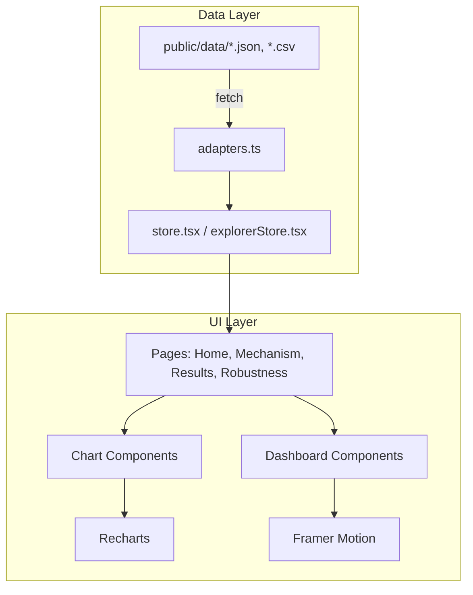
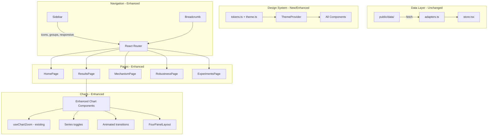
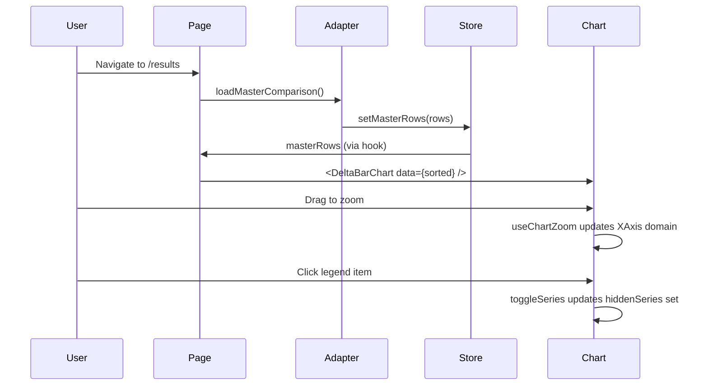

# Design Document: Dashboard UI Redesign

## Overview

This design covers the UI/UX redesign of the thesis dashboard for "Adaptive Skill and Stake in Forecast Markets" by Anastasia Cattaneo. The dashboard visualises pre-run experiment outputs from a forecast market mechanism that combines online skill learning with stake-based wagering (Lambert 2008, Raja-Pinson extension).

The redesign addresses three core problems:
1. The current sidebar lacks icons, responsive behaviour, and visual grouping
2. Charts are functional but lack interactive polish (no drag-zoom on most pages, inconsistent tooltips, no series toggles on results charts)
3. Experiment results are not presented with the narrative structure the thesis demands: "does it work?" → "where?" → "why?" → "when does it break?"

The thesis research question drives every design decision:
> Can combining stake with an online, time-varying skill layer improve aggregate forecasts under non-stationarity, strategic behaviour, and intermittent participation?

### Narrative Flow

The dashboard tells a story in four acts, each mapped to a route:

| Act | Route | Question | Key Charts |
|-----|-------|----------|------------|
| 1. Understand | `/` Overview | What is this mechanism? | System architecture, round timeline |
| 2. Does it work? | `/results` | Does skill×stake beat baselines? | Master comparison bars, cumulative CRPS lines, calibration |
| 3. How? | `/mechanism` | How does one round work? | Interactive pipeline, skill/wealth/error timelines |
| 4. When does it break? | `/robustness` | Where are the limits? | Intermittency, sybil, sensitivity, behaviour experiments |

### Standardised 4-Panel Output

Every experiment result section follows the same visual contract (from NEXT_STEPS.md):

| Panel | Content | Chart Type |
|-------|---------|------------|
| Primary outcome | Relative CRPS or Brier improvement (Δ vs baseline) | Horizontal bar with error bars |
| Calibration | PIT or reliability diagram | Scatter on diagonal |
| Market structure | Wealth/influence concentration (HHI, N_eff, Gini) | Grouped bar |
| Failure mode | Where the method breaks | Context-dependent (heatmap, line, scatter) |

## Architecture

### Current Architecture



### Redesigned Architecture

The redesign preserves the existing data layer (adapters, store, types) and focuses on the UI layer. No new data fetching patterns are introduced.



### Key Architectural Decisions

1. **No new state management**: The existing `store.tsx` and `explorerStore.tsx` are sufficient. Theme state is added to localStorage via a lightweight `ThemeProvider` context, not the main store.

2. **Progressive enhancement**: All chart enhancements (zoom, toggles, animations) are added to existing chart components rather than replacing them. The `useChartZoom` hook already exists and is used on MechanismPage/RobustnessPage; it will be extended to all chart instances.

3. **Responsive strategy**: Tailwind breakpoints (`sm:`, `md:`, `lg:`) handle layout shifts. The sidebar uses three modes: full (≥1024px), icon-only (768–1023px), hidden with hamburger (<768px). This is CSS-driven with a small state toggle for the mobile drawer.

4. **Dark mode via CSS custom properties**: Tailwind's `dark:` variant with a class-based toggle on `<html>`. Chart colours reference CSS variables so Recharts picks up theme changes without re-rendering the chart data.


## Components and Interfaces

### 1. Navigation Components

#### Sidebar (Enhanced: `components/dashboard/Sidebar.tsx`)

Current: Plain text NavLinks, fixed 192px width, no icons, no responsive behaviour.

Redesigned:
- Each route gets an SVG icon (inline, 16×16) alongside the text label
- Routes grouped into "Primary" (Overview, Mechanism, Results, Robustness) and "Secondary" (Appendix, Experiments) with a subtle divider
- Active route: teal-500 left border accent (3px), teal-50 background, teal-700 text
- Hover: slate-800 background, 100ms transition
- Responsive modes:
  - `≥1024px`: Full sidebar (192px), icons + text
  - `768–1023px`: Icon-only (48px), expand to full on hover with `onMouseEnter`/`onMouseLeave`
  - `<768px`: Hidden; hamburger icon in a top bar opens a slide-out drawer (Framer Motion `AnimatePresence`)
- Header: "Skill × Stake" title + "Thesis dashboard" subtitle (existing), plus theme toggle button

```typescript
interface SidebarProps {
  // No props needed; reads route from React Router, theme from ThemeProvider
}

interface NavItem {
  to: string;
  label: string;
  icon: React.FC<{ className?: string }>;
  group: 'primary' | 'secondary';
}
```

#### Breadcrumb (New: `components/dashboard/Breadcrumb.tsx`)

Renders the current route path as clickable segments. On tabbed pages (Results, Robustness), appends the active tab name.

```typescript
interface BreadcrumbProps {
  /** Override the final segment label (e.g., active tab name) */
  activeTab?: string;
}
```

Placement: Top of the main content area, below any page header, above content. Uses `useLocation()` from React Router to derive segments.

### 2. Chart Components (Enhanced)

All six existing chart components gain consistent interactive features:

#### Shared Chart Enhancements

Every chart wrapped in `ChartCard` gets:
- **Drag-to-zoom**: `useChartZoom` hook (already exists) applied to XAxis domain + ReferenceArea overlay
- **Reset zoom button**: `ZoomBadge` component (already exists in MechanismPage/RobustnessPage, extracted to shared)
- **Series toggles**: For multi-series charts, legend items are clickable to show/hide series (already implemented in `SkillTrajectoryChart`, standardised across all)
- **Animated transitions**: Recharts `isAnimationActive` with 300ms duration on data changes
- **Fullscreen expand**: Already in `ChartCard` via the expand button + `ExpandModal`
- **InfoToggle**: Each chart gets a help popover explaining what the chart shows, what the axes mean, and how to interpret it

#### FourPanelLayout (New: `components/charts/FourPanelLayout.tsx`)

The standardised 4-panel experiment output layout.

```typescript
interface FourPanelLayoutProps {
  /** Panel 1: Primary outcome chart (Δ CRPS bar) */
  primary: React.ReactNode;
  /** Panel 2: Calibration chart (PIT/reliability) */
  calibration: React.ReactNode;
  /** Panel 3: Market structure chart (HHI, N_eff, Gini bars) */
  structure: React.ReactNode;
  /** Panel 4: Failure mode chart (context-dependent) */
  failure: React.ReactNode;
  /** Experiment title */
  title: string;
  /** One-sentence thesis point this experiment makes */
  thesisPoint: string;
}
```

Layout: 2×2 grid on `≥1024px`, stacked on smaller screens. Each panel is a `ChartCard` with a panel-specific subtitle.

#### DeltaBarChart (New: `components/charts/DeltaBarChart.tsx`)

Horizontal bar chart for paired deltas (Δ CRPS vs baseline). Used in master comparison and ablation views.

```typescript
interface DeltaBarChartProps {
  data: Array<{
    label: string;
    delta: number;
    se?: number;
    color: string;
  }>;
  /** Reference line at x=0 */
  baselineLabel?: string;
  /** Axis label */
  metricLabel?: string;
}
```

Visual: Bars extend left (negative = better) or right (positive = worse) from a zero reference line. Error bars shown when `se` is provided. Rank badges (#1, #2, etc.) on the left.

#### ConcentrationPanel (New: `components/charts/ConcentrationPanel.tsx`)

Grouped bar chart showing Gini, HHI, and N_eff side by side for each method.

```typescript
interface ConcentrationPanelProps {
  data: Array<{
    method: string;
    label: string;
    color: string;
    gini?: number;
    hhi?: number;
    nEff?: number;
  }>;
}
```

### 3. Page Components (Enhanced)

#### ResultsPage (Enhanced)

Current: Has headline answer cards, accuracy ranking, concentration bars, calibration, ablation. Good structure but needs:
- 4-panel layout for master comparison
- Clearer visual hierarchy: headline cards → ranked list → evidence tabs
- Tab transitions: horizontal slide animation (200ms) via Framer Motion `AnimatePresence` with `mode="wait"`
- Ablation: waterfall-style chart showing which pipeline step (A–E) creates the gain

#### RobustnessPage (Enhanced)

Current: Three sections (intermittency, sybil, sensitivity) with good chart work. Needs:
- 4-panel layout per robustness test
- Behaviour experiment cards for the full behaviour matrix
- Failure mode panel for each test (e.g., "at what participation rate does accuracy degrade?")

#### ExperimentsPage (Enhanced)

Current: Exists at `/appendix/experiments`. Needs:
- Card grid layout with filter controls (block category) and search
- Each card: experiment name, description (2-line truncation), block badge, 3 key metrics
- Framer Motion `layoutId` for smooth grid re-layout on filter change

### 4. Design System Components

#### ThemeProvider (New: `lib/themeProvider.tsx`)

```typescript
interface ThemeContextValue {
  theme: 'light' | 'dark';
  toggleTheme: () => void;
}
```

- Reads `localStorage.getItem('theme')` on mount
- Falls back to `window.matchMedia('(prefers-color-scheme: dark)')` on first visit
- Toggles `dark` class on `document.documentElement`
- Persists choice to localStorage

#### Skeleton (New: `components/dashboard/Skeleton.tsx`)

Pulsing placeholder for loading states. Matches the dimensions of the component it replaces.

```typescript
interface SkeletonProps {
  width?: string;
  height?: string;
  className?: string;
  variant?: 'rect' | 'circle' | 'text';
}
```

#### ErrorBoundary (Enhanced: `components/dashboard/DataStates.tsx`)

Inline error display within the affected component area. Shows error message + retry button. Does not break surrounding layout.

### 5. Visual Hierarchy for Charts

Each chart type communicates a specific thesis point:

| Chart | Thesis Point | Visual Priority | Key Design Choice |
|-------|-------------|-----------------|-------------------|
| DeltaBarChart (master comparison) | Skill×stake beats baselines | Highest — first thing on Results | Bars sorted by Δ, mechanism highlighted with thicker stroke |
| Cumulative CRPS lines | Accuracy gap grows over time | High — shows the "when" | Mechanism line 2.5px, others 1.2px, 0.6 opacity |
| Calibration scatter | Forecasts are well-calibrated | Medium — supports the claim | Diagonal reference line, points coloured by distance from ideal |
| Ablation waterfall | Which pipeline step matters | Medium — explains "why" | Waterfall bars showing incremental contribution |
| Skill trajectory lines | Online layer recovers skill ordering | Medium — core thesis contribution | Agent lines with toggleable visibility, brush for time range |
| Sweep heatmap | Mechanism is not brittle | Lower — robustness evidence | λ × σ_min grid, colour intensity = metric value |
| Behaviour bars | Adversaries don't break the mechanism | Lower — robustness evidence | Horizontal bars sorted by impact |
| Participation heatmap | Intermittency is handled | Lower — robustness evidence | Agent × time blocks, colour = participation rate |


## Data Models

### Existing Data Models (Unchanged)

The redesign does not modify any data types. All types in `lib/types.ts` remain as-is:

- `ExperimentMeta` — experiment metadata from `index.json`
- `MasterComparisonRow` — method comparison with paired deltas
- `BankrollAblationRow` — ablation variants with delta vs full
- `ForecastSeriesPoint` — per-round CRPS across weighting rules
- `CalibrationPoint` — reliability diagram data (τ, p̂)
- `SweepPoint` — parameter sweep grid (λ, σ_min, metrics)
- `SkillWagerPoint` — per-agent per-round skill/wager/profit
- Various behaviour row types (PreferenceStressRow, IntermittencyStressRow, ArbitrageScanRow, etc.)

### New UI State Models

#### Theme State

```typescript
type Theme = 'light' | 'dark';
// Stored in localStorage under key 'theme'
// Applied as class on <html> element
```

#### Sidebar Responsive State

```typescript
interface SidebarState {
  mode: 'full' | 'icon-only' | 'hidden';  // derived from viewport width
  drawerOpen: boolean;  // mobile drawer state
  hoverExpanded: boolean;  // icon-only mode hover expansion
}
```

#### Chart Interaction State

The existing `useChartZoom` hook provides zoom state. Series visibility is managed per-chart via local `useState<Set<string>>` (already implemented in `SkillTrajectoryChart`, to be standardised).

```typescript
// Already exists in useChartZoom.ts
interface ZoomState {
  left: string | number;
  right: string | number;
  refLeft: string;
  refRight: string;
  isZoomed: boolean;
}

// Per-chart series visibility (local state)
type HiddenSeries = Set<string>;
```

#### Experiment Card Grid State

```typescript
interface ExperimentGridState {
  blockFilter: 'all' | 'core' | 'behaviour' | 'experiments';
  searchQuery: string;
}
```

### Data Flow



### CSS Custom Properties for Theming

```css
:root {
  --bg-primary: #ffffff;
  --bg-card: #ffffff;
  --bg-muted: #f8fafc;
  --text-primary: #0f172a;
  --text-secondary: #475569;
  --text-muted: #94a3b8;
  --border: #e2e8f0;
  --chart-grid: #e2e8f0;
  --chart-axis: #94a3b8;
}

.dark {
  --bg-primary: #0f172a;
  --bg-card: #1e293b;
  --bg-muted: #1e293b;
  --text-primary: #f1f5f9;
  --text-secondary: #94a3b8;
  --text-muted: #64748b;
  --border: #334155;
  --chart-grid: #334155;
  --chart-axis: #64748b;
}
```

Chart components reference these variables via the `shared.ts` constants, which are updated to read from CSS custom properties when dark mode is active.


## Correctness Properties

*A property is a characteristic or behavior that should hold true across all valid executions of a system — essentially, a formal statement about what the system should do. Properties serve as the bridge between human-readable specifications and machine-verifiable correctness guarantees.*

### Property 1: Sidebar renders icons, labels, and active styling for every route

*For any* route in the navigation configuration, the rendered Sidebar should contain both an SVG icon element and a text label for that route, and the NavLink corresponding to the currently active route should have the highlighted background class and accent indicator applied.

**Validates: Requirements 1.1, 1.2**

### Property 2: Sidebar responsive mode matches viewport width

*For any* viewport width, the Sidebar should render in the correct mode: full (≥1024px), icon-only (768–1023px), or hidden with hamburger (<768px). The layout mode should be a deterministic function of viewport width.

**Validates: Requirements 1.6, 7.1, 7.2, 7.3**

### Property 3: Breadcrumb segments match route path including active tab

*For any* route (including tabbed pages with an active tab), the Breadcrumb component should render clickable segments that correspond to each part of the route path, with the active tab name appended as the final segment on tabbed pages.

**Validates: Requirements 2.1, 2.3**

### Property 4: Breadcrumb click navigates to correct route

*For any* Breadcrumb segment, clicking it should trigger navigation to the route corresponding to that segment's path.

**Validates: Requirements 2.2**

### Property 5: Chart zoom round-trip

*For any* chart with zoom enabled, performing a drag-zoom (mouseDown at point A, mouseMove to point B, mouseUp) and then clicking the "Reset zoom" button should restore the XAxis domain to its original `['dataMin', 'dataMax']` value. This is a round-trip property: zoom → reset = identity.

**Validates: Requirements 3.1, 3.2**

### Property 6: Tooltip shows values for exactly the visible series

*For any* data point on a multi-series chart and *for any* subset of visible series (after toggling), the Tooltip should display numeric values for exactly the series that are currently visible — no more, no less.

**Validates: Requirements 3.3, 3.4**

### Property 7: Method colour tokens are semantically consistent

*For any* weighting method key (uniform, deposit, skill, mechanism), the colour assigned in `tokens.ts` and `formatters.ts` should be identical, and each method should have a unique colour distinct from all other methods.

**Validates: Requirements 4.1**

### Property 8: Text/background colour pairs meet WCAG contrast ratio

*For any* text/background colour pair defined in the theme (both light and dark modes), the computed contrast ratio should be at least 4.5:1 for normal text.

**Validates: Requirements 4.5**

### Property 9: MetricCard accent bar conditional rendering

*For any* MetricCard component, when the `accent` prop is `true`, the rendered output should contain a left-edge accent bar element; when `accent` is `false` or absent, no accent bar should be rendered.

**Validates: Requirements 4.4**

### Property 10: Answer cards contain all required fields

*For any* headline answer card rendered on the Results page, the card should contain all five required elements: a question title, a key metric value, a verdict indicator with colour coding, an interpretation sentence, and a caveat note.

**Validates: Requirements 5.1**

### Property 11: Method ranking is sorted by accuracy

*For any* set of method comparison results with ΔCRPS values, the displayed ranked list should be sorted in ascending order of ΔCRPS (most negative = best accuracy first). The sort order should be a stable function of the input data.

**Validates: Requirements 5.2**

### Property 12: Experiment cards contain all required fields

*For any* experiment in the experiment list, the rendered Experiment_Card should contain: the experiment name, a description (truncated to 2 lines), a block category badge, and up to 3 key metric values.

**Validates: Requirements 6.1**

### Property 13: Experiment grid filtering returns only matching experiments

*For any* combination of block filter and search query, the displayed Experiment_Cards should be exactly the subset of experiments whose block matches the filter (or all if filter is 'all') AND whose name or description contains the search query (case-insensitive).

**Validates: Requirements 6.3, 6.5**

### Property 14: Chart ResponsiveContainer maintains minimum height

*For any* chart component, the ResponsiveContainer should specify a minimum height of at least 250px, ensuring charts remain readable at any parent width.

**Validates: Requirements 7.4**

### Property 15: Mechanism stepper click activates the correct step

*For any* step in the walkthrough stepper (Inputs, DGP, Behaviour, Core, Results, Next State), clicking that step's indicator should set it as the active step, and the active step should be visually highlighted with the primary accent colour.

**Validates: Requirements 8.2**

### Property 16: Dark mode applies correct theme tokens

*For any* theme state (light or dark), toggling to that state should apply the corresponding CSS class on the document element and update all CSS custom properties (background, text, border, chart grid, chart axis colours) to match the expected theme values.

**Validates: Requirements 9.2, 9.3**

### Property 17: Theme persistence round-trip

*For any* theme choice (light or dark), setting the theme should persist it to localStorage, and on a subsequent page load, reading from localStorage should restore the same theme. This is a round-trip: `setTheme(t) → localStorage.setItem → localStorage.getItem → getTheme() === t`.

**Validates: Requirements 9.4**

### Property 18: Theme defaults to OS preference on first visit

*For any* OS colour scheme preference (light or dark), when no theme is stored in localStorage, the dashboard should default to the OS preference as reported by `prefers-color-scheme`.

**Validates: Requirements 9.5**

### Property 19: Data loading error isolation

*For any* page with multiple data-dependent components, if one component's data fetch fails, the error should be displayed inline within that component's area, and all other components on the page should continue to render normally.

**Validates: Requirements 10.3**


## Error Handling

### Data Loading Errors

The dashboard loads experiment data from static files in `public/data/`. Errors can occur when:

1. **File not found (404)**: An experiment listed in `index.json` has missing data files. The existing `fetchCSV`/`fetchJSON` in `adapters.ts` already throw on non-200 responses.
2. **Parse errors**: Malformed CSV or JSON. PapaParse handles CSV gracefully (returns partial data); JSON parse errors throw.
3. **Missing experiment data**: No `index.json` or empty experiment list.

**Strategy:**

- **Component-level error boundaries**: Each data-dependent section (chart, card, panel) catches its own errors and renders an inline error message with a retry button. This prevents one broken experiment from taking down the whole page.
- **Fallback to demo mode**: The Results page already falls back to in-browser pipeline demo when experiment data is unavailable. This pattern is extended to Robustness page.
- **Skeleton → Error transition**: While loading, show skeleton placeholders. On error, replace skeleton with error message. On success, replace skeleton with content.
- **No silent failures**: Every fetch error is logged to console in dev mode (existing behaviour) and shown to the user as an inline message.

### Theme Errors

- **localStorage unavailable**: If localStorage is blocked (e.g., private browsing in some browsers), the theme provider catches the error and falls back to OS preference without persisting.
- **Invalid stored value**: If localStorage contains an invalid theme value, default to OS preference.

### Chart Interaction Errors

- **Empty data**: Charts handle empty arrays gracefully by showing an empty state message instead of rendering an empty chart.
- **NaN/Infinity values**: The existing `fmt()` and `fmtNum()` formatters already handle NaN/null. Chart data is filtered to exclude non-finite values before rendering.
- **Zoom to zero-width range**: The `useChartZoom` hook already handles the case where `refLeft === refRight` by not applying the zoom.

### Navigation Errors

- **Unknown routes**: The existing catch-all `<Route path="*" element={<Navigate to="/" replace />} />` handles unknown routes.
- **Breadcrumb on unknown paths**: The Breadcrumb component gracefully handles paths not in the route config by showing only the segments it can resolve.

## Testing Strategy

### Dual Testing Approach

The testing strategy uses both unit tests and property-based tests:

- **Unit tests** (Vitest + React Testing Library): Specific examples, edge cases, error conditions, and integration points
- **Property-based tests** (fast-check): Universal properties across generated inputs, minimum 100 iterations per property

### Property-Based Testing Configuration

- **Library**: [fast-check](https://github.com/dubzzz/fast-check) — the standard PBT library for TypeScript/JavaScript
- **Minimum iterations**: 100 per property test
- **Tag format**: Each property test includes a comment referencing the design property:
  ```typescript
  // Feature: dashboard-ui-redesign, Property 5: Chart zoom round-trip
  ```
- **Each correctness property is implemented by a single property-based test**

### Test Plan

#### Property-Based Tests

| Property | Test Description | Generator Strategy |
|----------|-----------------|-------------------|
| P1: Sidebar icons/labels/active | Generate random route from ROUTES array, render Sidebar, check icon + label + active class | `fc.constantFrom(...ROUTES)` |
| P2: Sidebar responsive mode | Generate random viewport width (300–2000px), check sidebar mode | `fc.integer({min: 300, max: 2000})` |
| P3: Breadcrumb segments | Generate random route path + optional tab name, check segments | `fc.constantFrom(...ALL_ROUTES)` × `fc.option(fc.constantFrom(...TABS))` |
| P4: Breadcrumb navigation | Generate random breadcrumb segment, simulate click, check navigation | `fc.constantFrom(...BREADCRUMB_SEGMENTS)` |
| P5: Zoom round-trip | Generate random start/end points for drag, zoom in, reset, check domain restored | `fc.tuple(fc.integer({min: 1, max: 500}), fc.integer({min: 1, max: 500}))` |
| P6: Tooltip visible series | Generate random subset of series to hide, hover a point, check tooltip content | `fc.subarray(ALL_SERIES)` |
| P7: Method colour consistency | Generate random method key, check colour matches across tokens.ts and formatters.ts | `fc.constantFrom(...METHOD_KEYS)` |
| P8: Contrast ratio | Generate all theme colour pairs, compute contrast ratio, check ≥ 4.5 | Enumerate all pairs from theme config |
| P9: MetricCard accent | Generate random accent boolean, render MetricCard, check accent bar presence | `fc.boolean()` |
| P10: Answer card fields | Generate random answer card data, render, check all 5 fields present | `fc.record({question: fc.string(), metric: fc.string(), ...})` |
| P11: Method ranking sort | Generate random array of method results with ΔCRPS values, check sort order | `fc.array(fc.record({method: fc.string(), deltaCrps: fc.float()}))` |
| P12: Experiment card fields | Generate random ExperimentMeta, render card, check required fields | Custom ExperimentMeta arbitrary |
| P13: Experiment filtering | Generate random experiment list + filter + query, check filtered results | `fc.array(experimentMetaArb)` × `fc.constantFrom('all','core','behaviour','experiments')` × `fc.string()` |
| P14: Chart min height | Enumerate all chart components, check ResponsiveContainer minHeight ≥ 250 | Enumerate chart component list |
| P15: Stepper click | Generate random step from WALKTHROUGH_STEPS, simulate click, check active state | `fc.constantFrom(...WALKTHROUGH_STEPS)` |
| P16: Dark mode tokens | Generate random theme state, toggle, check CSS class and custom properties | `fc.constantFrom('light', 'dark')` |
| P17: Theme persistence | Generate random theme, set it, read from localStorage, check match | `fc.constantFrom('light', 'dark')` |
| P18: Theme OS default | Generate random OS preference, clear localStorage, check theme matches | `fc.constantFrom('light', 'dark')` |
| P19: Error isolation | Generate random component to fail, simulate fetch error, check other components render | `fc.constantFrom(...COMPONENT_IDS)` |

#### Unit Tests (Examples and Edge Cases)

| Test | Description | Validates |
|------|-------------|-----------|
| Sidebar groups have divider | Render Sidebar, check primary/secondary groups separated by divider | Req 1.3 |
| Sidebar header text | Render Sidebar, check "Skill × Stake" and subtitle present | Req 1.5 |
| ChartCard expand modal | Click expand button, check modal renders | Req 3.6 |
| Results tabs exist | Render ResultsPage, check all expected tabs present | Req 5.3 |
| Results error fallback | Simulate data load failure, check error message + retry + demo banner | Req 5.5 |
| Experiment card click navigates | Click an experiment card, check navigation to detail route | Req 6.2 |
| Mechanism stepper structure | Render stepper, check numbered indicators and connecting lines | Req 8.1 |
| Theme toggle button exists | Render Sidebar, check theme toggle button present | Req 9.1 |
| Skeleton loading state | Set loading=true, check skeleton elements rendered | Req 10.1 |
| Empty experiment state | Set experiments=[], check empty state message | Req 10.4 |
| Card grid columns at breakpoints | Render grid at 500px, 800px, 1200px, check column counts 1, 2, 3+ | Req 7.5 |

