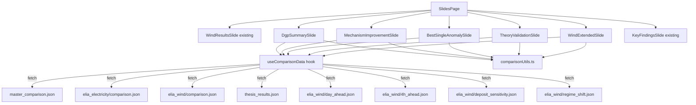

# Design Document: DGP vs Real-Data Comparison

## Overview

This feature adds five new comparison slides to the existing Slides tab that juxtapose DGP (simulation) results with real-world Elia data and thesis theory claims. The slides tell a narrative: summary comparison → mechanism improvement magnitude → best-single anomaly → theory validation → wind extended analysis.

The implementation follows the established slide component pattern: each slide is a standalone React component wrapped in `SlideWrapper`, fetching its own data via `useEffect` + `fetch` with `{ data, error, loading }` state. A shared utility module provides DGP multi-seed aggregation and CRPS formatting functions used across all five slides.

Key design decisions:
1. **Shared data-loading hook** (`useComparisonData`) — avoids duplicating fetch/abort/error logic across 5 slides. Returns `{ data, error, loading }` matching the existing `ResultsSlide` pattern.
2. **Pure aggregation functions** — DGP multi-seed averaging and formatting are pure functions in a utility module, making them testable without DOM or fetch mocking.
3. **Graceful partial failure** — each data source (DGP, electricity, wind, thesis, wind-extended) loads independently; a failure in one does not block the others.

## Architecture



### Data Flow

1. `SlidesPage` renders the five comparison slide components in sequence after the existing Wind Results slide.
2. Each slide calls `useComparisonData(paths)` which fetches one or more JSON files, manages loading/error/abort state, and returns typed data.
3. DGP data passes through `aggregateByMethod()` to compute cross-seed means before display.
4. Formatting functions (`formatCrps`, `formatDelta`, `formatPercent`, `deltaColor`) are shared from `comparisonUtils.ts`.

## Components and Interfaces

### New Files

| File | Purpose |
|------|---------|
| `src/components/slides/comparison/DgpSummarySlide.tsx` | Req 1: Side-by-side CRPS table across DGP, electricity, wind |
| `src/components/slides/comparison/MechanismImprovementSlide.tsx` | Req 2: % improvement bars + insight cards |
| `src/components/slides/comparison/BestSingleAnomalySlide.tsx` | Req 3: best_single vs mechanism comparison + insight cards |
| `src/components/slides/comparison/TheoryValidationSlide.tsx` | Req 4: thesis claims vs real-data evidence |
| `src/components/slides/comparison/WindExtendedSlide.tsx` | Req 5: day-ahead, 4h-ahead, deposit sensitivity, regime shift |
| `src/components/slides/comparison/InsightCard.tsx` | Reusable insight highlight card |
| `src/lib/comparison/comparisonUtils.ts` | Pure formatting + aggregation functions |
| `src/lib/comparison/useComparisonData.ts` | Shared data-fetching hook |
| `src/lib/comparison/types.ts` | TypeScript interfaces for all comparison data |

### Modified Files

| File | Change |
|------|--------|
| `src/pages/SlidesPage.tsx` | Import and render 5 comparison slides after Wind Results, before KeyFindings |

### Component Interfaces

```typescript
// ── types.ts ──

/** Row from real-data comparison.json or master_comparison.json */
export interface ComparisonRow {
  experiment: string;
  method: string;       // "uniform" | "skill" | "mechanism" | "best_single" | "deposit"
  seed: number;
  DGP: string;
  preset: string;
  mean_crps: number;
  delta_crps_vs_equal: number;
}

/** Config from master_comparison.json */
export interface DgpConfig {
  T: number;
  n_forecasters: number;
  seeds: number[];
}

/** Full master_comparison.json shape */
export interface DgpData {
  config: DgpConfig;
  rows: ComparisonRow[];
}

/** Config from real-data comparison.json */
export interface RealDataConfig {
  T: number;
  n_forecasters: number;
  warmup: number;
  series_name: string;
  forecasters: string[];
}

/** Full real-data comparison.json shape */
export interface RealComparisonData {
  config: RealDataConfig;
  rows: ComparisonRow[];
  per_round: unknown[];
}

/** Aggregated method row (after cross-seed averaging) */
export interface AggregatedRow {
  method: string;
  meanCrps: number;
  meanDelta: number;
  seedCount: number;
}

/** Thesis claim from thesis_results.json */
export interface ThesisClaim {
  id: string;
  title: string;
  claim: string;
  metric: string;
  metricLabel: string;
  interpretation: string;
  caveat: string;
  experimentName: string;
  category: string;
}

/** Deposit sensitivity data shape */
export interface DepositSensitivityData {
  deposit_sensitivity: Record<string, {
    uniform: number;
    skill: number;
    mechanism: number;
    delta_skill: number;
    delta_mech: number;
    pct_skill: number;
    pct_mech: number;
  }>;
}

/** Wind experiment row (day_ahead, 4h_ahead, regime_shift) */
export interface WindExperimentData {
  config: {
    T: number;
    n_forecasters: number;
    warmup: number;
    horizon: number;
    label: string;
    forecasters: string[];
  };
  rows: ComparisonRow[];
  per_round: unknown[];
}

// ── Hook return type ──

export interface UseDataResult<T> {
  data: T | null;
  error: string | null;
  loading: boolean;
}

// ── InsightCard props ──

export interface InsightCardProps {
  icon: string;
  color: string;       // Tailwind bg class, e.g. "bg-amber-500"
  title: string;
  description: string;
}
```

### useComparisonData Hook

```typescript
function useComparisonData<T>(
  path: string,
  validate?: (json: unknown) => json is T
): UseDataResult<T>
```

Follows the same `useEffect` + `AbortController` pattern as `ResultsSlide`. Accepts an optional type guard for runtime validation. Returns `{ data, error, loading }`.

### Pure Utility Functions (comparisonUtils.ts)

```typescript
/** Group DGP rows by method, compute arithmetic mean of mean_crps and delta_crps_vs_equal */
function aggregateByMethod(rows: ComparisonRow[]): AggregatedRow[]

/** Format CRPS to 6 decimal places */
function formatCrps(value: number): string

/** Format ΔCRPS with sign prefix; returns "—" for zero */
function formatDelta(value: number): string

/** Format percentage to 1 decimal place with % suffix */
function formatPercent(value: number): string

/** Return Tailwind color class for delta: green for negative, red for positive, slate for zero */
function deltaColor(value: number): string

/** Compute percentage improvement: (mechanism - uniform) / uniform * 100 */
function computeImprovement(uniformCrps: number, methodCrps: number): number
```

## Data Models

### DGP Master Comparison (`master_comparison.json`)

- **Config**: `{ T: 500, n_forecasters: 10, seeds: [42..241] }` — 200 seeds
- **Rows**: ~1000 rows (5 methods × 200 seeds), each with `method`, `seed`, `mean_crps`, `delta_crps_vs_equal`
- **Methods**: `uniform`, `deposit`, `skill`, `mechanism`, `best_single`
- **Aggregation**: Group by method → arithmetic mean of `mean_crps` and `delta_crps_vs_equal` → produces 5 `AggregatedRow` objects
- Note: `deposit` method has identical values to `uniform` under `fixed_deposits` preset; we filter to the 4 core methods (uniform, skill, mechanism, best_single) for display consistency with real data

### Real-Data Comparison Files

**Electricity** (`elia_electricity/data/comparison.json`):
- Config: T=10,000, 5 forecasters, warmup=200
- 4 rows: uniform, skill, mechanism, best_single (single seed=0)

**Wind** (`elia_wind/data/comparison.json`):
- Config: T=17,544, 5 forecasters, warmup=200
- 4 rows: same methods (single seed=0)

### Wind Extended Data

| File | T | Horizon | Key insight |
|------|---|---------|-------------|
| `day_ahead.json` | 732 | 1 | Mechanism beats uniform; best_single worse than aggregation |
| `4h_ahead.json` | 20,000 | 16 | Mechanism close to best_single; longer horizon helps aggregation |
| `deposit_sensitivity.json` | — | — | Fixed deposit best for mechanism; bankroll worst |
| `regime_shift.json` | 17,544 | 1 | Mechanism still improves under non-stationarity; best_single dominates |

### Thesis Claims (`thesis_results.json`)

Array of 5 `ThesisClaim` objects. For this feature, we use two:
- `skill_improves_accuracy` — validated by DGP ΔCRPS < 0, weak-confirmed by electricity
- `equal_is_strong_baseline` — supported by electricity ΔCRPS ≈ 0, challenged by wind ΔCRPS ≈ −0.02


## Correctness Properties

*A property is a characteristic or behavior that should hold true across all valid executions of a system — essentially, a formal statement about what the system should do. Properties serve as the bridge between human-readable specifications and machine-verifiable correctness guarantees.*

### Property 1: Multi-seed aggregation produces correct arithmetic means

*For any* array of `ComparisonRow` objects with arbitrary method names, seed values, and CRPS values (including edge cases like a single seed per method or many methods), `aggregateByMethod` SHALL return one `AggregatedRow` per unique method where `meanCrps` equals the arithmetic mean of all `mean_crps` values for that method, `meanDelta` equals the arithmetic mean of all `delta_crps_vs_equal` values for that method, and `seedCount` equals the number of rows for that method.

**Validates: Requirements 1.1, 7.1, 7.2**

### Property 2: Delta formatting and coloring are sign-consistent

*For any* numeric delta value, `formatDelta` and `deltaColor` SHALL produce consistent outputs: when the value is zero, `formatDelta` returns "—" and `deltaColor` returns the neutral slate class; when negative, `formatDelta` returns a string starting with "−" and `deltaColor` returns the green class; when positive, `formatDelta` returns a string starting with "+" and `deltaColor` returns the red class. All non-zero formatted strings SHALL contain exactly 6 decimal digits.

**Validates: Requirements 9.2, 9.4, 9.5**

### Property 3: Percentage improvement computation

*For any* uniform CRPS value > 0 and any method CRPS value ≥ 0, `computeImprovement(uniformCrps, methodCrps)` SHALL return `(uniformCrps - methodCrps) / uniformCrps * 100`, and `formatPercent` applied to the result SHALL produce a string ending with "%" containing exactly 1 decimal digit.

**Validates: Requirements 2.1, 9.3**

### Property 4: Best method identification selects minimum CRPS

*For any* non-empty array of `{ method: string, crps: number }` objects with distinct CRPS values, the best-method identification function SHALL return the method with the strictly lowest CRPS value.

**Validates: Requirements 1.5**

## Error Handling

| Scenario | Handling |
|----------|----------|
| DGP JSON fetch fails (network error, 404) | `useComparisonData` sets `error` string; slide renders error banner for DGP column; electricity and wind columns still render if their fetches succeeded |
| Real-data JSON fetch fails | Same pattern — error banner for that dataset; other datasets unaffected |
| Thesis results fetch fails | Theory Validation slide shows error message; DGP and real-data comparison content still renders (Req 4.5) |
| Wind extended file fails | Error message for that specific experiment; other wind experiments still render (Req 5.5) |
| Unexpected JSON shape | `useComparisonData` validate function rejects; treated as load failure with descriptive error |
| Component unmounts during fetch | `AbortController.abort()` called in `useEffect` cleanup; `AbortError` caught and ignored (Req 8.3) |
| DGP data has zero rows for a method | `aggregateByMethod` returns empty array for that method; table omits it |
| Division by zero in improvement calc | `computeImprovement` returns 0 when `uniformCrps` is 0 |

## Testing Strategy

### Unit Tests (Example-Based)

Focus on specific content, structural checks, and integration scenarios:

- **Slide ordering**: Verify the 5 comparison slides appear after Wind Results and before KeyFindings in SlidesPage
- **SlideWrapper usage**: Verify each comparison slide renders inside a SlideWrapper
- **DgpSummarySlide**: Mock all 3 fetches; verify table has 4 method rows × 3 dataset columns; verify best method is highlighted per column
- **MechanismImprovementSlide**: Verify percentage bars and 2 insight cards render with expected text
- **BestSingleAnomalySlide**: Verify best_single vs mechanism comparison and 3 insight cards
- **TheoryValidationSlide**: Verify 2 thesis claims displayed with evidence labels
- **WindExtendedSlide**: Verify day-ahead, 4h-ahead, deposit sensitivity, and regime shift sections render
- **Partial failure**: Mock one fetch to fail, verify error banner for that dataset and successful rendering of others
- **Loading state**: Verify loading indicator appears before data resolves and disappears after
- **AbortController**: Mount then unmount component, verify no state-update warnings
- **Seed count label**: Verify "averaged over N seeds" footnote appears with correct N from DGP config

### Property-Based Tests

Using `fast-check`:

- **Property 1**: Generate 100+ random `ComparisonRow[]` arrays with 1–5 methods and 1–20 seeds each, verify `aggregateByMethod` output matches hand-computed arithmetic means
  - Tag: `Feature: dgp-real-data-comparison, Property 1: Multi-seed aggregation produces correct arithmetic means`
  - Minimum 100 iterations

- **Property 2**: Generate 100+ random numbers (including 0, negatives, positives, very small values), verify `formatDelta` and `deltaColor` produce sign-consistent outputs with correct formatting
  - Tag: `Feature: dgp-real-data-comparison, Property 2: Delta formatting and coloring are sign-consistent`
  - Minimum 100 iterations

- **Property 3**: Generate 100+ random pairs of (uniformCrps > 0, methodCrps ≥ 0), verify `computeImprovement` matches the formula and `formatPercent` output ends with "%" and has 1 decimal
  - Tag: `Feature: dgp-real-data-comparison, Property 3: Percentage improvement computation`
  - Minimum 100 iterations

- **Property 4**: Generate 100+ random non-empty arrays of {method, crps} with distinct CRPS values, verify the best-method function returns the entry with minimum CRPS
  - Tag: `Feature: dgp-real-data-comparison, Property 4: Best method identification selects minimum CRPS`
  - Minimum 100 iterations

### Integration Tests

- **Data loading**: Mock HTTP for all 8 data files using actual JSON structure; verify all 5 slides render with correct values
- **SlidesPage route**: Verify `/slides` route renders SlidesPage and comparison slides appear in authenticated state
