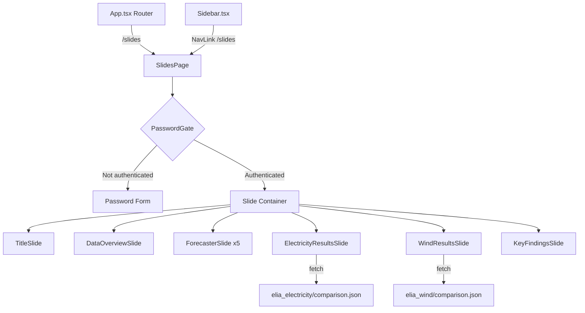

# Design Document: Slides Tab

## Overview

The Slides Tab adds a password-protected, scrollable presentation view to the Skill × Stake thesis dashboard. It renders at the `/slides` route and presents 10 vertically stacked full-width slides covering the thesis title, real-world datasets, forecaster explanations, CRPS performance results, and key findings.

The feature integrates into the existing React + TypeScript + Tailwind CSS dashboard by:
1. Adding a "Slides" entry to the Sidebar's secondary navigation group
2. Adding a `/slides` route in App.tsx
3. Creating a new `SlidesPage` component with a `PasswordGate` wrapper
4. Loading comparison.json data from the existing `public/data/real_data/` directories

Authentication is session-only (React state), with no persistence to localStorage or cookies.

## Architecture



The architecture follows the existing dashboard pattern: a page component in `src/pages/`, sub-components for each slide, and data fetched from `public/data/`. The `PasswordGate` is a local wrapper component that conditionally renders either the password form or the slide content based on React state.

### Key Design Decisions

1. **Single page with vertical scroll** rather than a carousel or pagination — matches the "scrollable slide-format" requirement and keeps implementation simple.
2. **Password state lifted to SlidesPage** — the `PasswordGate` receives `isAuthenticated` and `onAuthenticate` as props from `SlidesPage`, keeping state in the page component. This means navigating away and back preserves auth as long as the component stays mounted (React state only, per Req 2.5).
3. **Static forecaster content** — forecaster descriptions are hardcoded as data arrays, not fetched, since they are fixed thesis content.
4. **Comparison data fetched on mount** — `useEffect` + `fetch` for the two comparison.json files, with loading/error states.

## Components and Interfaces

### New Files

| File | Purpose |
|------|---------|
| `src/pages/SlidesPage.tsx` | Page component: manages auth state, renders PasswordGate or slide content |
| `src/components/slides/PasswordGate.tsx` | Password form UI with error feedback |
| `src/components/slides/TitleSlide.tsx` | Title, subtitle, date, author |
| `src/components/slides/DataOverviewSlide.tsx` | Dataset cards for electricity and wind |
| `src/components/slides/ForecasterSlide.tsx` | Reusable forecaster explanation card |
| `src/components/slides/ResultsSlide.tsx` | Performance summary table for a dataset |
| `src/components/slides/KeyFindingsSlide.tsx` | Summary of key takeaways |
| `src/components/slides/SlideWrapper.tsx` | Shared wrapper for consistent slide spacing/styling |

### Modified Files

| File | Change |
|------|--------|
| `src/App.tsx` | Add `<Route path="/slides" element={<SlidesPage />} />` |
| `src/components/dashboard/Sidebar.tsx` | Add Slides NavItem to secondary group |

### Component Interfaces

```typescript
// PasswordGate props
interface PasswordGateProps {
  onAuthenticate: () => void;
}

// SlideWrapper — shared layout wrapper
interface SlideWrapperProps {
  children: React.ReactNode;
  className?: string;
}

// ForecasterSlide — one per forecaster
interface ForecasterData {
  name: string;
  type: string;           // e.g. "Baseline", "Statistical", "Machine Learning"
  description: string;
  strengths: string;
  weaknesses: string;
}

// ResultsSlide — one per dataset
interface ResultsSlideProps {
  title: string;          // e.g. "Electricity Results"
  dataPath: string;       // e.g. "data/real_data/elia_electricity/data/comparison.json"
}

// Comparison data shape (from comparison.json)
interface ComparisonConfig {
  T: number;
  n_forecasters: number;
  warmup: number;
  series_name: string;
  forecasters: string[];
}

interface ComparisonRow {
  method: string;         // "uniform" | "skill" | "mechanism" | "best_single"
  mean_crps: number;
  delta_crps_vs_equal: number;
}

interface ComparisonData {
  config: ComparisonConfig;
  rows: ComparisonRow[];
  per_round: Array<{
    t: number;
    y: number;
    crps_uniform: number;
    crps_skill: number;
    crps_mechanism: number;
    crps_best_single: number;
  }>;
}
```

### Sidebar Integration

A new entry is added to the `NAV_ITEMS` array in `Sidebar.tsx`:

```typescript
{ to: '/slides', label: 'Slides', icon: SlidesIcon, group: 'secondary' }
```

A simple presentation/slides SVG icon will be created inline, following the existing 16×16 inline SVG pattern used by other nav items.

## Data Models

### Static Data (hardcoded in component)

**Forecaster definitions** — array of 5 `ForecasterData` objects:

| Name | Type | Description |
|------|------|-------------|
| Naive (last value) | Baseline | Uses most recent observed value; zero computational cost; works well for random walks |
| Moving Average (20) | Statistical | Averages last 20 observations; smooths short-term noise; window of 20 balances responsiveness/stability |
| ARIMA(2,1,1) | Statistical | Autoregressive integrated moving average (p=2, d=1, q=1); captures linear temporal dependencies after differencing |
| XGBoost | Machine Learning | Gradient-boosted decision tree ensemble; captures non-linear patterns; trained on lagged features |
| Neural Net (MLP) | Machine Learning | Multi-layer perceptron; learns non-linear mappings from lagged inputs; most flexible but data-hungry |

**Dataset definitions** — array of 2 dataset card objects:

| Dataset | Rounds | Forecasters | Source |
|---------|--------|-------------|--------|
| Elia Electricity | 10,000 | 5 | Belgian electricity load from Elia TSO |
| Elia Wind | 17,544 | 5 | Belgian wind power generation from Elia TSO |

**Key findings** — array of 3 finding strings (Req 8.2–8.4).

### Fetched Data

Two `ComparisonData` objects loaded from:
- `data/real_data/elia_electricity/data/comparison.json`
- `data/real_data/elia_wind/data/comparison.json`

Only the `config` and `rows` fields are used for the Performance Summary display. The `per_round` array is not needed for the slides (it contains thousands of entries for time-series charts).

### Authentication State

```typescript
// In SlidesPage component
const [isAuthenticated, setIsAuthenticated] = useState(false);
```

No data model beyond a single boolean. The password `"anastasia"` is compared directly in the `PasswordGate` submit handler.


## Correctness Properties

*A property is a characteristic or behavior that should hold true across all valid executions of a system — essentially, a formal statement about what the system should do. Properties serve as the bridge between human-readable specifications and machine-verifiable correctness guarantees.*

Most acceptance criteria for this feature are specific content checks (exact text, exact ordering) or visual design constraints, which are best covered by example-based tests. However, two areas have meaningful input variation suitable for property-based testing:

### Property 1: Invalid passwords are always rejected

*For any* string that is not exactly `"anastasia"`, submitting it to the password validation function SHALL return `false` and the authentication state SHALL remain `false`.

This covers edge cases like near-matches ("Anastasia", "anastasia ", " anastasia", "ANASTASIA"), empty strings, whitespace-only strings, and arbitrary random strings.

**Validates: Requirements 2.3**

### Property 2: Performance summary displays all comparison rows

*For any* valid `ComparisonData` object containing 1–10 rows with arbitrary `method` names, `mean_crps` values in [0, 1], and `delta_crps_vs_equal` values in [-1, 1], the Performance Summary render function SHALL produce output containing every row's `method`, formatted `mean_crps`, and formatted `delta_crps_vs_equal`.

**Validates: Requirements 7.3, 7.4**

## Error Handling

| Scenario | Handling |
|----------|----------|
| Comparison JSON fetch fails (network error, 404) | Display a user-friendly error message in place of the Performance Summary (Req 7.5). Use a `{ data: null, error: string, loading: boolean }` state pattern. |
| Comparison JSON has unexpected shape | Treat as load failure — display same error message. Validate that `rows` array exists before rendering. |
| Password field submitted empty | Treat as incorrect password — show error message (same path as Req 2.3). |
| Component unmounts during fetch | Use AbortController to cancel in-flight requests and prevent state updates on unmounted components. |

## Testing Strategy

### Unit Tests (Example-Based)

Focus on specific content and structural checks:

- **Sidebar integration**: Verify "Slides" nav item exists in secondary group with correct `to="/slides"` prop
- **Password gate**: Correct password grants access; incorrect password shows error; empty submission shows error
- **Slide ordering**: Verify slides render in the correct sequence (Title → Data Overview → 5 Forecasters → Electricity → Wind → Key Findings)
- **Title slide content**: Verify "Skill × Stake", subtitle, date "13/08/2025", author are present
- **Dataset cards**: Verify electricity (10,000 rounds) and wind (17,544 rounds) cards contain required fields
- **Forecaster cards**: Verify each of the 5 forecaster cards contains name, type, description, strengths, weaknesses
- **Key findings**: Verify all 3 summary statements are present
- **Error state**: Mock fetch failure, verify error message renders in place of Performance Summary
- **Auth persistence**: Verify no writes to localStorage or cookies

### Property-Based Tests

Using `fast-check` (already in devDependencies):

- **Property 1**: Generate 100+ random strings (excluding exact "anastasia"), verify all are rejected by the password validation function
  - Tag: `Feature: slides-tab, Property 1: Invalid passwords are always rejected`
  - Minimum 100 iterations
- **Property 2**: Generate 100+ random `ComparisonData.rows` arrays with arbitrary method names and CRPS values, verify the formatting function includes all rows' data
  - Tag: `Feature: slides-tab, Property 2: Performance summary displays all comparison rows`
  - Minimum 100 iterations

### Integration Tests

- **Data loading**: Verify that `SlidesPage` successfully fetches and renders real comparison.json data (mock HTTP, use actual JSON structure)
- **Route integration**: Verify `/slides` route renders `SlidesPage` within the app router

